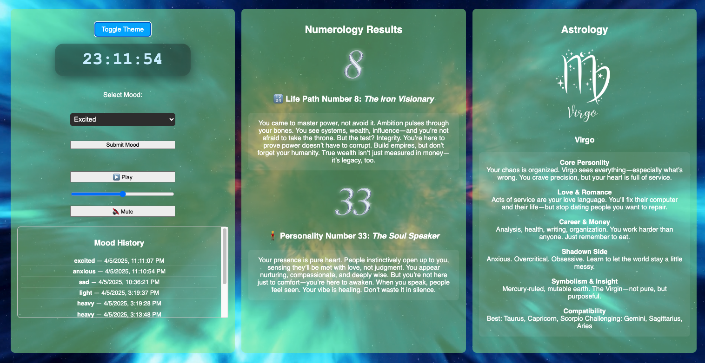
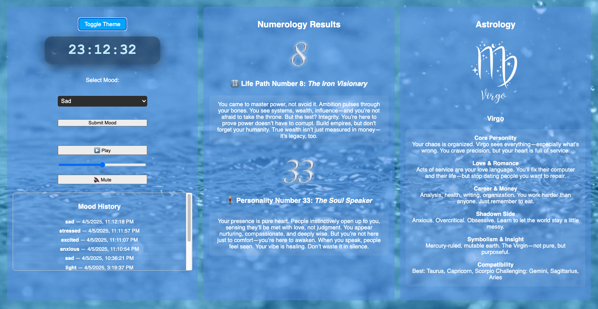

# 🔮 MysticClock — A Mood-Switching Video Clock Web App

**MysticClock** is a responsive, full-screen video clock that visually adapts to different user moods. Built for the browser and optimized for mobile and desktop, this project lets users toggle between moods—like calm, chaotic, or melancholic—and watch the background seamlessly shift with animated videos while the current time is always front and center.

## 📸 Screenshots

### Excited Mood

### Sad Mood

---

## 🎯 Features

- ⏰ **Real-Time Clock** — Live digital clock synced to system time.
- 🎭 **Mood Toggles** — Instantly switch the background video based on selected emotional themes.
- 📱 **Mobile Optimized** — Full responsive layout with inline video fixes for iOS.
- 📹 **Seamless Video Transitions** — No refresh, no reload. Just pure mood-shifting fluidity.
- 💡 **Clean UI** — Minimalist design, maximum impact.

---

## 🧠 Why I Built This

Sometimes a clock isn’t just a clock. This was a front-end coding challenge in aesthetic control, emotional UX, and mobile video behavior. I also wanted a lightweight, mood-enhancing screen you could leave on in the background—sort of like a moving art piece that also tells time.

---

## 🚀 Tech Stack

- **HTML5** — Semantic layout and structural markup
- **CSS3** — Full responsive styling
- **JavaScript (Vanilla)** — Mood toggling and dynamic time display
- **MP4 Videos** — Background mood loops, optimized for inline playback

---

## 📱 Mobile Compatibility

This project includes explicit iOS fixes:
- `playsinline` on all `<video>` elements
- `muted` and `autoplay` setup to bypass mobile autoplay restrictions
- Touch-safe transitions for mood changes

---

## 🌐 Live Demo

See it live on GitHub Pages:  
[Personlize Your Mystic Clock!](https://robert-calvin-dev.github.io/mysticclock/personlization.html)